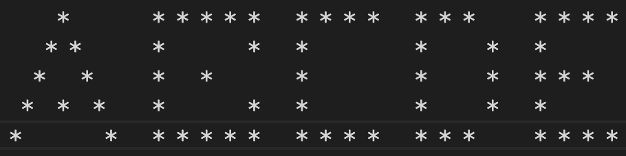

# Example task `returnTheFirstElement` from an array
- create a function, inside the `returnTheFirstElement.js` file, name it `returnTheFirstElement`
- It should take an array as an input and return the first element as the output.
- If there is no first element, return 'Please enter a valid input'

### Example of input:
- [1, 2, 3]
- ['x', 'y', 'z']
- []
- null

# Task 1 - `returnTheLastElement` from an array
- create a function, inside a file `returnTheLastElement{name}.js`, name it `returnTheLastElement{firstName}`
- It should take an array as an input and return the last element from the array as the output.
- If there is no last element, return 'Please enter a valid input'
- Please also create a filed named `returnTheLastElement{firstName}.spec.js`

### Example of input:
- [1, 2, 3]
- ['x', 'y', 'z']
- []
- null

# Task 2 - `writeMeALetter`
- create a function, inside a file `writeMeALetter{name}.js`, name it `writeMeALetter{firstName}`
- It should take an array of arrays of numbers [[1, 2, 3], [1, 2, 3]]
- These are the coordinates of where you should place a '*' in the grid.
- The grid will always be 9 spaces long and 5 spaces tall.

### example:

